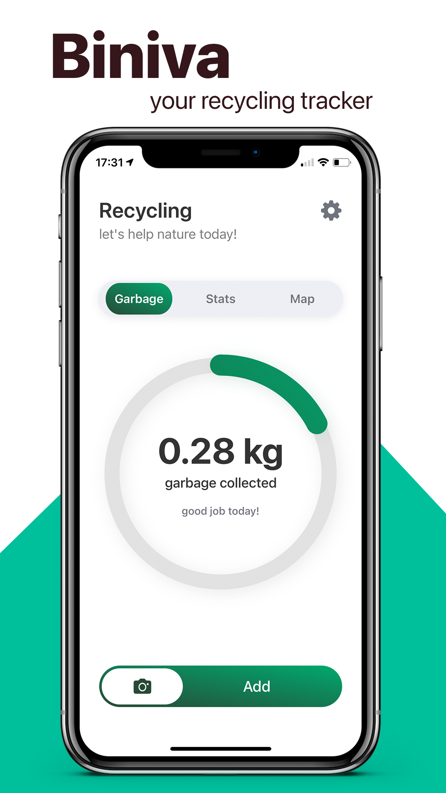
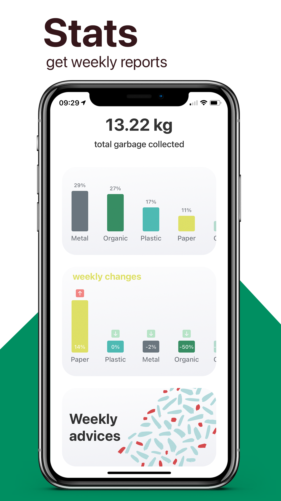
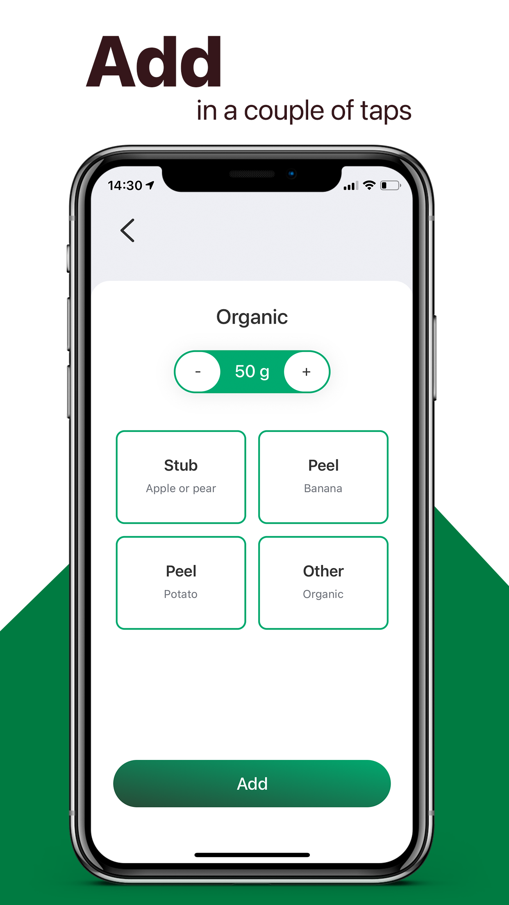
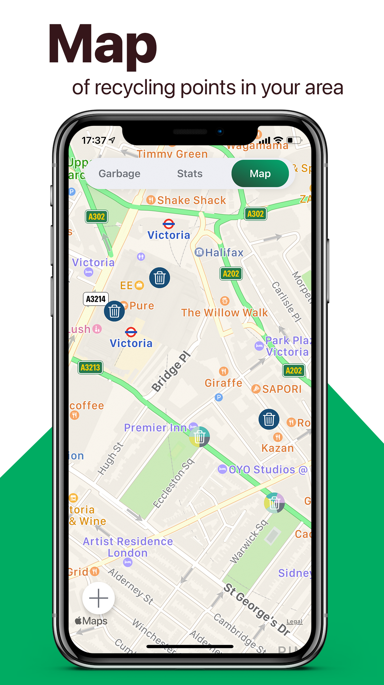
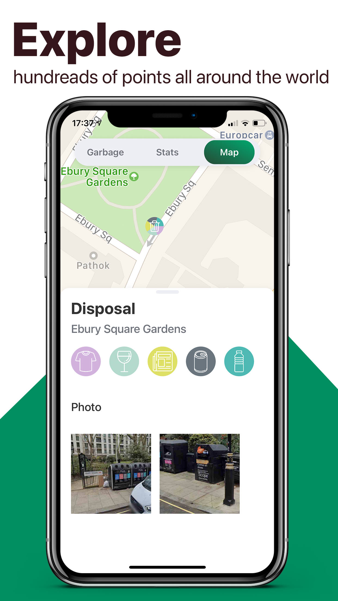

The app is published and can be downloaded from AppStore via the [link](https://apps.apple.com/tr/app/biniva-трекер-мусора/id1551525911). 

## Main Idea
This is an app with eco-map (map of all recycling points in the user's location). It's also a personal consumption tracker that allows users to track the weight of their trash on daily bases. That allows to change habits and get important advices.

## Main Features
- Worldwide map of all trash-recycling points with photos and allowed materials
- More then 1000 point are added in the map in 6 countries (England, Switzerland, New Zeland, Montenegro, Ukrain, Russia)
- Personal consumption tracker
- Stats and dashbords of user's consumption
- Weekly in-divice generated Zero Waste suggestions

## Photos
</img>
</img>
</img>
</img>
</img>

## Monetization
The app uses free-to-use monetization strategy. The consumption tracker and all features of the map is available for every user.
Weekly Zero Waste suggestions are available after the donation.

## Backend
The app uses Firebase Firestore as DB and backend service.
All network functions are available in Firebase folder.

## Tracked Data
We do not track any personalized data. All colected data is used for better app development and checking ads perfomance.
All tracking functions are available in Firebase folder.
[Privacy Policy](http://greener.tilda.ws/privacy_policy/en) and [Terms of Use](http://greener.tilda.ws/terms_of_use/en). 

## Backlog
App redisign (in progress).

